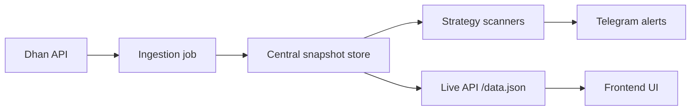

# Market Context Data Flow

This file explains, in plain language, how data moves through the system from Dhan into storage, then into strategies, alerts, and the website.

## 1. Big Picture

The important idea is:

- Dhan is the source of truth for market data.
- The backend stores that data in parquet-based snapshot folders.
- Strategies read from the stored snapshots, not from the API over and over again.
- The website reads from the live API and snapshot store so the UI can show the latest available state.

## 2. Main Storage Layers

### A. Central snapshot store

Location:

- `backend/data/center_store/`

This is the reusable storage layer used by the backend.

It keeps:

- latest snapshot parquet for each timeframe
- historical snapshot parquet files
- candle history parquet files by symbol / market / interval
- artifact parquet files for signals, features, and alerts

Common subfolders:

- `everyminute_center_daa/` for minute-style storage
- `15_min_center_data/` for 15 minute storage
- `commodities_daily/` for commodities daily snapshots
- `dashboard_center_data/` for dashboard snapshot output

### B. Frontend snapshot

Location:

- `frontend/data.json`

This is the public JSON snapshot used by the website.

It is updated by `daily_run.py` and other publishing paths.

### C. Strategy candidate pool

Location:

- `backend/data/strategy_candidate_pools/`

Example:

- `backend/data/strategy_candidate_pools/india_ema9_growth30_on.json`

This file stores the explicit 4-day candidate pool for the 9 EMA strategy.
The pattern scanner uses it first when it wants to know which symbols should be watched closely.

## 3. Core Scripts

### `backend/market_candle_ingestion.py`

Role:

- fetches fresh candle data from Dhan
- writes candle history into the central snapshot store
- keeps the live fetch work in one place

Think of this as the “data collector”.

### `backend/daily_run.py`

Role:

- runs the main daily strategy and market snapshot build
- publishes dashboard data
- publishes commodity daily data
- updates `frontend/data.json`
- writes to the central snapshot store
- performs cleanup after market close

Think of this as the “daily publisher”.

### `backend/pattern_oi_vwap_ema_scanner.py`

Role:

- reads candle history and strategy pools from storage
- computes pattern / OI / VWAP / EMA conditions
- emits alert artifacts
- sends Telegram alerts when a symbol qualifies

Think of this as the “live scanner”.

### `backend/start_live.py`

Role:

- starts the live API
- keeps the scanner running
- restarts the scanner if it exits

Think of this as the “supervisor”.

### `backend/live_server.py`

Role:

- serves live dashboard data to the frontend
- exposes `/live`
- exposes suggestion-box endpoints and supporting routes

Think of this as the “API layer for the UI”.

### `backend/run_all.py`

Role:

- orchestrates ingestion
- runs the post-close swing jobs
- runs `daily_run.py`
- optionally runs `auto_trader.py`

Think of this as the “daily scheduler wrapper”.

## 4. Typical End-to-End Flow

### During market hours

1. `market_candle_ingestion.py` fetches the newest candles from Dhan.
2. The fetched candles are written into `backend/data/center_store/...`.
3. `pattern_oi_vwap_ema_scanner.py` reads from that store and evaluates the current signals.
4. If a symbol passes the rules, the scanner writes signal/alert artifacts and sends Telegram.
5. `live_server.py` serves the newest available data to the frontend.
6. The frontend shows the live values in the India page, commodity page, and other sections.

### After market close

1. `daily_run.py` builds the final daily snapshot.
2. Strategy outputs are written into `frontend/data.json`.
3. Dashboard and commodity snapshots are also published into the central store.
4. Cleanup removes old snapshot history according to retention settings.
5. Post-close jobs such as swing scans can run later in the evening.

## 5. What the UI Reads

The UI uses two main sources:

- `http://127.0.0.1:8765/live` in local development or the deployed live API
- `frontend/data.json` and the snapshot store when live data is unavailable or when the page needs a published snapshot

For the India page, the current intent is:

- show live values only
- avoid showing stale EOD values as if they are live
- show `NIFTY`, `BANKNIFTY`, and `SENSEX` together when live data is available

## 6. What the Strategy Scanner Reads

The scanner does not need to refetch everything from Dhan every time if the candle history is already stored.

It reads:

- candle history from the snapshot store
- the explicit 4-day EMA9 candidate pool file
- the current market snapshot if needed for context

Then it computes:

- pattern detection
- OI related checks
- VWAP and EMA checks
- gate 1 / gate 2 / gate 3 / gate 4 logic

If a symbol passes, the scanner creates:

- a signal artifact
- an alert artifact
- a Telegram message

## 7. Why This Structure Helps

- Fewer duplicate Dhan calls
- Faster scanners
- Easier debugging
- Same data source for UI and strategies
- Clear retention and cleanup
- Better rollback safety because the stored artifacts remain available

## 8. Files You Will Usually Look At

- `backend/market_candle_ingestion.py`
- `backend/market_snapshot_store.py`
- `backend/daily_run.py`
- `backend/pattern_oi_vwap_ema_scanner.py`
- `backend/live_server.py`
- `backend/start_live.py`
- `backend/run_all.py`
- `frontend/app.js`
- `frontend/data.json`

## 9. Short Version

If you remember only one sentence, use this:

> Dhan fetches candles once, the backend stores them in parquet snapshots, scanners compute signals from those stored files, and the UI reads the latest published snapshot.

